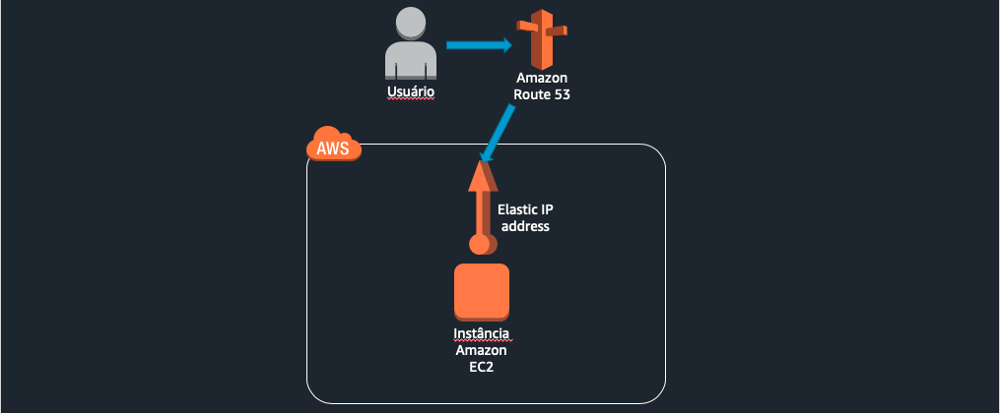
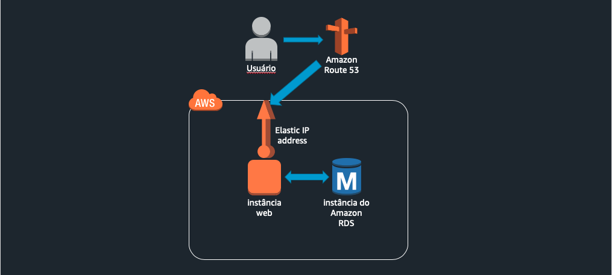
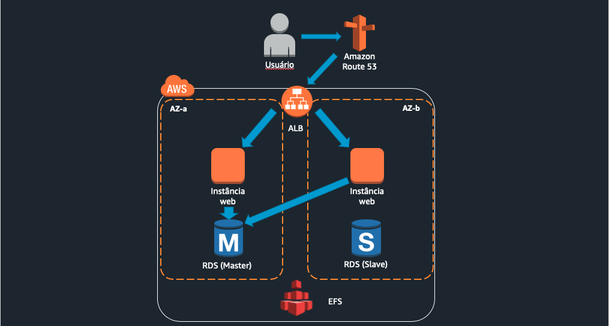
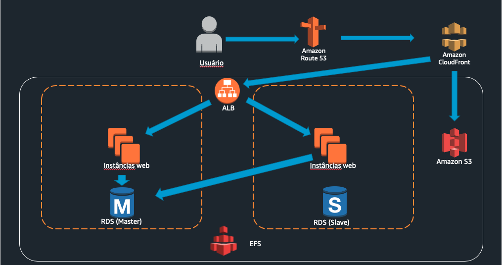
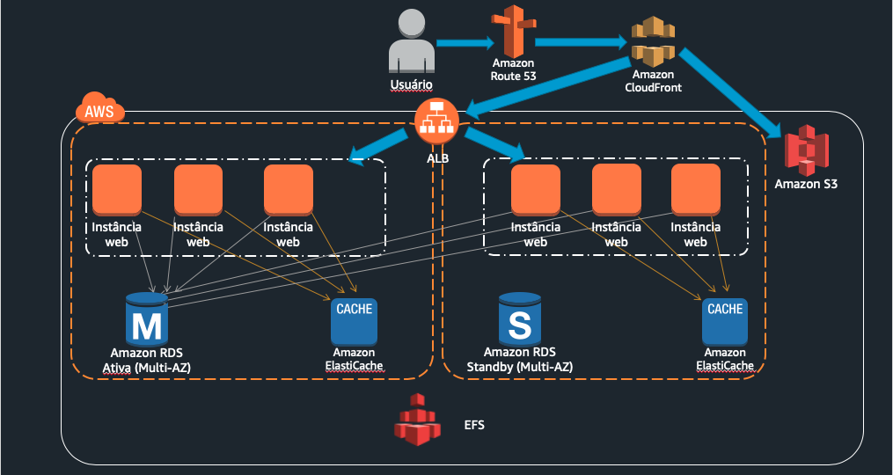
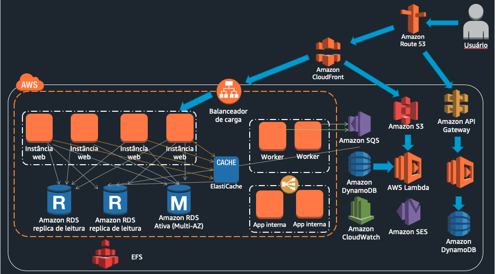

# AWS Brasil - Conteúdo da série de Webinars para Educação apresentandos em 2020

## Escalando o ambiente Moodle na AWS para milhares de usuários em uma hora (30/04)

Neste primeiro webinar, da série do segmento de Educação, criamos um ambiente Moodle do zero, começando com requisitos mínimos de escalabilidade e disponibilidade e evoluindo para uma arquitetura mais robusta conforme a mudança de requisitos.

Em cada etapa foi feito um teste de carga para validar a arquitetura proposta. Você pode replicar a solução de teste de carga que se encontra na pasta **[utils](../utils/)**.

As arquiteturas de cada etapa foram:

### Poucos usuários

 

 

### Centenas de usuários

 

 

### Milhares de usuários

 

 

### Centenas de milhares de usuários

 

 

### Meio milhão

 

 

### Próximos passos

 

 

## Referências

- [Escalando do Zero aos Seus Primeiros 10 Milhões de Usuários](https://pt.slideshare.net/AmazonWebServices/escalando-do-zero-aos-seus-primeiros-10-milhes-de-usurios-arc203-sao-paulo-summit)
- [Moodle Backup](https://docs.moodle.org/38/en/Site_backup)
- [Moodle Restore](https://docs.moodle.org/38/en/Site_restore)
- [MySqlDump Backup & Restore](https://www.codigofonte.com.br/dicas/backup-e-restore-no-mysql-com-mysqldump)
- [Moodle Cluster](https://docs.moodle.org/38/en/Server_cluster)
- [Moodle Desempenho & Escalabilidade](https://docs.moodle.org/dev/Performance_and_scalability)
- [CloudWatch Agent](https://docs.aws.amazon.com/pt_br/AWSEC2/latest/UserGuide/mon-scripts.html#mon-scripts-permissions)
- [AWS Moodle Refarch](https://github.com/aws-samples/aws-refarch-moodle)
- [Kroton: How to Provide Learning Content to Millions of Students Using AWS (Portuguese)](https://www.youtube.com/watch?v=aRM4Ja5KPIY)
